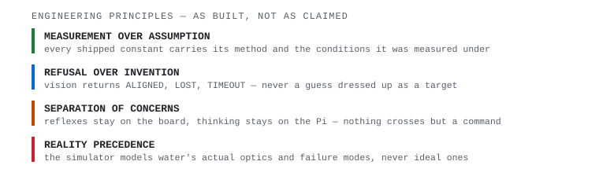
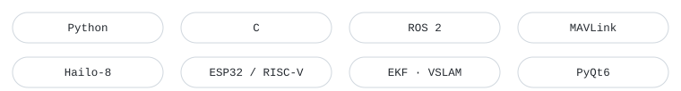

<em>the lab, one of the later nights.</em>

  

# Fahim Faisal

**Autonomy engineer.** Machines that perceive, reason, and act — underwater, in the air, on the ground — and that have to work correctly when nobody is watching.

Dhaka, Bangladesh · [fh1m.github.io](https://fh1m.github.io) · *Proof of work, not adjectives.*

 

### what i build

<picture>
  <source media="(prefers-color-scheme: dark)" srcset="assets/stat-strip-dark.svg">
  <source media="(prefers-color-scheme: light)" srcset="assets/stat-strip-light.svg">
  
</picture>

| underwater | ground | air |
|---|---|---|
| state estimation, real-time vision, embedded control loops | inverse kinematics, edge vision, GPS-denied navigation | guidance, navigation and control, flight software |

Numbers above are counted, not estimated — [method on the site](https://fh1m.github.io).

 

### how i think

<picture>
  <source media="(prefers-color-scheme: dark)" srcset="assets/philosophy-dark.svg">
  <source media="(prefers-color-scheme: light)" srcset="assets/philosophy-light.svg">
  
</picture>

The first principle is that you must not fool yourself — and you are the easiest person to fool.

 

### stack

<picture>
  <source media="(prefers-color-scheme: dark)" srcset="assets/stack-dark.svg">
  <source media="(prefers-color-scheme: light)" srcset="assets/stack-light.svg">
  
</picture>

 

---

Every number on this page has a method behind it, same as on <a href="https://fh1m.github.io">fh1m.github.io</a> — ask and I'll show the measurement, not just the claim. Reach me at <strong>fh1m.faisal.work@gmail.com</strong>.

