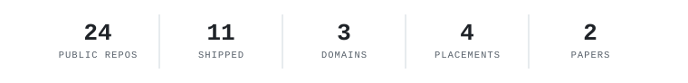

<em>Duburi workstation, RoboSub 2025 — one of the later nights.</em>

  

# Fahim Faisal

**Autonomy engineer.** Machines that perceive, reason, and act — underwater, in the air, on the ground — and that have to work correctly when nobody is watching.

Dhaka, Bangladesh · [fh1m.github.io](https://fh1m.github.io) · *Proof of work, not adjectives.*

 

### what i build

<picture>
  <source media="(prefers-color-scheme: dark)" srcset="assets/stat-strip-dark.svg">
  <source media="(prefers-color-scheme: light)" srcset="assets/stat-strip-light.svg">
  
</picture>

| underwater | ground | air |
|---|---|---|
| AUV autonomy — EKF state estimation, real-time vision, 500 Hz embedded control | rover autonomy — inverse kinematics, edge vision, GPS-denied navigation | GNC — thrust-vector control, flight software, rocketry |

Proof of work, not adjectives. Numbers above are counted, not estimated — [method on the site](https://fh1m.github.io).

 

### selected work

- **[mongla_ws](https://github.com/fh1m/mongla_ws)** — underwater autonomy stack, full writeup and retractions on the site
- **[Duburi](https://github.com/fh1m/Duburi)** — the vehicle: hull, thrusters, control board · RoboSub 2025 semifinals, Entrepreneurship award
- **[Dristy](https://github.com/fh1m/Dristy)** — embedded vision firmware and host API

University Rover Challenge 2025 — global top 10. Two peer-reviewed papers. Four competition placements, three domains.

 

### stack

`Python` `C` `ROS 2` `MAVLink` `Hailo-8` `ESP32 / RISC-V` `EKF · VSLAM` `PyQt6`

 

---

Every number on this page has a method behind it, same as on <a href="https://fh1m.github.io">fh1m.github.io</a> — ask and I'll show the measurement, not just the claim. Reach me at <strong>fh1m.faisal.work@gmail.com</strong>.

