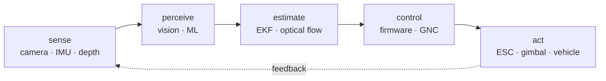

# Fahim Faisal

**Autonomy systems · robotics · embedded control**

Perception, estimation, and control for machines that operate outside the screen.

Portfolio = context · Work index = breadth · Mongla = deepest current system · Repositories = source · Log = chronology · Now = active direction

## The record

A compact view of the public engineering surface.

| **PUBLIC WORK** | **ACTIVE PERIOD** | **CONTROL** | **VISION** | **TESTED STACK** |
|:---:|:---:|:---:|:---:|:---:|
| `24 repos` | `2023 → now` | `500 Hz` | `53.9 Hz` | `4,208 tests` |

The recurring problem is not “which framework?” It is whether the measurement arrives in time, the estimate is honest, and the actuator does what the model asked.

## Engineering trajectory

From first-principles software to integrated vehicle autonomy.

**Foundations** 
[Scripts](https://github.com/fh1m/Scripts) · [PDE](https://github.com/fh1m/PDE) · [linear regression](https://github.com/fh1m/Linear-Regression) · [decision trees](https://github.com/fh1m/decision-tree-classifier) · [calibration challenge](https://github.com/fh1m/calib_challenge_fh1m)

Python, C, computer vision, first-principles ML, developer tooling, and the first attempts to make a machine infer something useful.

**Vehicle systems** 
[BRACU Duburi](https://github.com/fh1m/Duburi) · [Duburi R&D](https://github.com/fh1m/duburi-codebase_RND) · [Duburi simulator](https://github.com/fh1m/duburi-sim_ws) · [Arduino Vision](https://github.com/fh1m/Arduino-Vision)

Underwater robotics, simulation, embedded sensing, mission software, and vision that had to work on hardware rather than in a notebook.

**Perception becomes a subsystem** 
[Dristy](https://github.com/fh1m/Dristy) · [tracking and prediction](https://github.com/fh1m/Track_and_Predict) · [colour-sign detection](https://github.com/fh1m/Detect-color-signs) · [secure P2P chat](https://github.com/fh1m/secure-terminal-p2p-chat)

On-device vision, compact protocols, prediction, image processing, and systems that keep working when bandwidth and compute are limited.

**Integrated autonomy** 
[Mongla](https://github.com/fh1m/mongla_ws) · [portfolio and research log](https://fh1m.github.io/) · [current work](https://fh1m.github.io/now)

ROS 2, MAVLink 2, board-level control, Hailo-8 perception, right-invariant EKF, optical flow, simulation, and evidence-labelled capability states.

## Measured work

Numbers are here to define interfaces and limits, not decorate the page.

| signal | what it says |
| --- | --- |
| **500 Hz** | the reflex loop belongs on the board |
| **53.9 Hz** | edge vision can produce a usable observation |
| **18.0 ms** | photon-to-detection was measured, not guessed |
| **44 bytes** | a movement request can cross the cable without smuggling in actuator logic |
| **4,208 tests** | the stack is larger than its demo |
| **320 × 240 / 25.4 FPS** | Dristy gives a small camera a bounded job |

> An ESC can report a perfectly respectable zero with nothing attached. A message count is not proof that a thruster is alive.

## Research, leadership, and field work

The surrounding work: research, competition systems, and engineering ownership.

[Underwater domain generalization](https://fh1m.github.io/about) · [RoboSub log](https://fh1m.github.io/log) · [URC work](https://fh1m.github.io/work) · [current direction](https://fh1m.github.io/now)

Rockets and UAVs: TVC control, flight computers, trajectory prediction, VSLAM, and GPS-denied navigation. 
Rovers: inverse kinematics, edge alignment, OCR, and competition data pipelines. 
Research: underwater object detection and recommendation systems. 
Leadership: engineering ownership across vision, autonomy integration, reliability, and field execution.

## Technical surface

The tools are broad; the invariant is the full loop from sensor to actuator.

`ROS 2` · `Python` · `C/C++` · `ESP32` · `K210` · `Hailo-8` · `MAVLink 2` · `OpenCV` · `EKF` · `Gazebo` · `ArduPilot`

Start with the work index for breadth, Mongla for depth, and the repositories when the claim needs inspection.

Dhaka, Bangladesh

