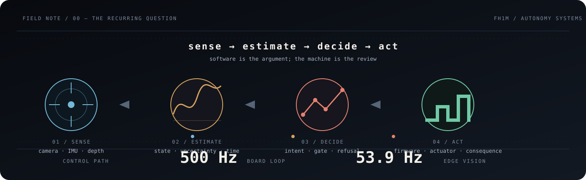
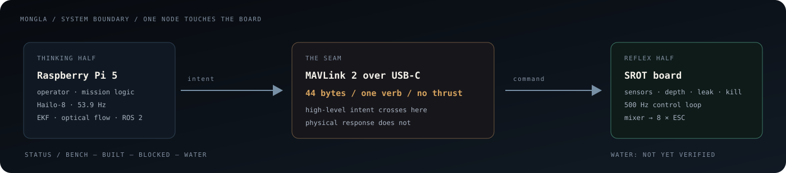

# FAHIM FAISAL

### Autonomy systems · robotics · embedded control

**I build machines for the interval between a measurement and its consequence.**

<a href="https://fh1m.github.io/">portfolio</a>
&nbsp;&nbsp;·&nbsp;&nbsp;
<a href="https://fh1m.github.io/mongla_ws/">Mongla / AUV autonomy</a>
&nbsp;&nbsp;·&nbsp;&nbsp;
<a href="https://github.com/fh1m?tab=repositories">repositories</a>

 

Dhaka, Bangladesh · software that has to meet the physical world

 

> **The machine does not care that the diagram was beautiful.**
>
> It cares whether the sensor was honest, whether the loop answered in time, and whether the system knew when to say **no**.

## The short version

I work across the stack that turns an uncertain world into an action:

`camera / IMU / depth` → `perception` → `state estimate` → `decision` → `firmware / actuator`

My work has taken the same set of questions into three very different places:

**[01 — underwater](https://fh1m.github.io/mongla_ws/)**  
*autonomous underwater vehicle* — make the board react before a companion computer can finish thinking.

**02 — flight**  
*rockets and UAVs* — navigate and control when GPS, clean models, and second chances disappear.

**03 — ground**  
*planetary-analog rovers* — make perception, manipulation, and data survive contact with a competition field.

The domains change. The discipline does not: define the boundary, measure the loop, expose the failure, then make the next decision smaller.

## 01 / the vehicle that has not been in water

**Mongla** is an independent ROS 2 autonomy stack for an autonomous underwater vehicle. It is also the clearest record of how I like to work.

The important split is architectural:

- The **SROT board** owns the reflexes: sensors, control, depth, leak detection, kill logic, and thrust mixing.
- The **Raspberry Pi 5 + Hailo-8** owns the thinking: detection, tracking, optical-flow velocity, mission logic, and estimation.
- One manager owns the wire. A mission bug cannot, by construction, write a thruster command directly.

  

### The numbers that survived contact with a measurement

`500 Hz` board loop · `53.9 Hz` Hailo-8 path · `18.0 ms` photon → detection  
`44 bytes` one MAVLink frame · `4,208` tests passing

The numbers are useful because their boundaries are visible:

- `500 Hz` is the control loop on the board, not a claim about the whole vehicle.
- `53.9 Hz` is the edge-vision path, not a promise that every downstream decision runs at that rate.
- `18.0 ms` is a measured photon-to-detection span.
- `44 bytes` is what `move_forward 3 --gain 40` becomes on the cable.
- `4,208` is the current test count in the repository README.

And the most important status is not a number:

> **Mongla has not been in water.**
>
> The repository separates `BENCH`, `BUILT`, `BLOCKED`, and `WATER` because a vehicle that reports success while doing nothing is worse than a vehicle that refuses to run.

**[Read the full case study →](https://fh1m.github.io/mongla_ws/)** · **[Inspect the repository →](https://github.com/fh1m/mongla_ws)**

## 02 / flight without the comforting parts

My rocketry and UAV work sits in guidance, navigation, and control:

- TVC gimbal control and trajectory prediction checked against real flight data.
- An in-house flight computer for a monocopter.
- VSLAM and navigation for GPS-denied flight.
- Work as part of the team behind Bangladesh's first hybrid rocket engine test.

The interesting engineering is usually not the algorithm name. It is the moment the algorithm meets a bad assumption: a delayed measurement, an actuator that is not where the model put it, or a vehicle whose state is only partly observable.

## 03 / ground truth has wheels

For planetary-analog rovers, I worked on the less glamorous pieces that decide whether autonomy survives a field:

- inverse kinematics for a dexterous arm;
- a standalone lightweight vision unit for alignment;
- custom OCR;
- the dataset pipeline behind a global top-10 University Rover Challenge run.

The pattern is familiar by now: perception is only useful when it is connected to a decision, and a decision is only useful when the rest of the machine can execute it.

## A small operating manual

### 01 — Put the fast loop next to the consequence

The Pi can think. The board has to answer. A cable is not a control loop.

### 02 — Give every claim a state

`bench` is not `water`. `built` is not `verified`. `blocked` is not failure; it is information with a next action attached.

### 03 — Make refusal a feature

An unsupported verb should return `UNSUPPORTED`. A stale firmware revision should fail the gate. A missing sensor should not be dressed up as a healthy value.

### 04 — Keep the seam inspectable

Interfaces, rates, ownership, and failure modes should be easier to find than the clever part.

## The human part

I was drawn to engineering through systems that refuse to stay abstract. A controller is not finished because the equation is correct; it is finished when the actuator responds, the sensor tells the truth often enough, and the failure is legible to the person standing next to the machine.

That has shaped the kind of engineer I am trying to become: ambitious about the system, conservative about the claim, and willing to keep the uncomfortable line in the README when the experiment has not earned a better one.

## Current coordinates

I am going deeper into **embedded control, perception, state estimation, and field robotics**—especially systems that have to make useful decisions with incomplete information and finite time.

The profile is the index. The [portfolio](https://fh1m.github.io/) is the longer argument. The [Mongla log](https://fh1m.github.io/mongla_ws/) is where the measurements and reversals live.

 

**[Enter the portfolio →](https://fh1m.github.io/)**

  

Fahim Faisal · Dhaka · autonomy systems

<!--
Maintenance:
- Keep this page evidence-led. Add a metric only with its measurement and source.
- Keep project claims scoped to the author's actual role.
- Update the Current coordinates section when the work changes.
-->
