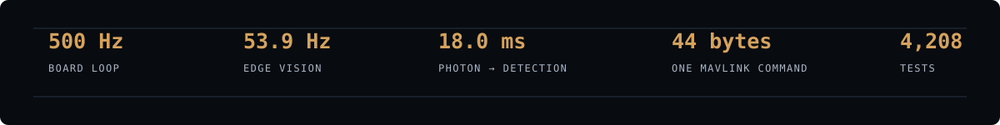

  

<h1 align="center">Fahim Faisal</h1>

  <strong>Autonomy systems · robotics · embedded control</strong> 
  Machines that perceive, reason, and act.

  <a href="https://fh1m.github.io/">Portfolio</a> ·
  <a href="https://fh1m.github.io/mongla_ws/">Mongla case study</a> ·
  <a href="https://github.com/fh1m?tab=repositories">All repositories</a>

 

  

## Technical signal

  

  <code>board / 500 Hz</code> ·
  <code>vision / 53.9 Hz</code> ·
  <code>host / 20–50 Hz</code> ·
  <code>wire / MAVLink 2</code>

## Selected work

  

**Mongla** — an independent ROS 2 autonomy stack for an underwater vehicle. 
The Pi thinks; the board reacts. **500 Hz** control, Hailo-8 perception, right-invariant EKF, and a codebase that labels what is `BENCH`, `BUILT`, `BLOCKED`, or actually `WATER`.

  

**Dristy** — a K210 camera that turns light into a small answer a robot can use. 
On-device detection, colour, motion, QR, tags, optical flow; **320×240** input, **25.4 FPS** camera path, no video stream for the flight computer to decode.

  

**Duburi / field robotics** — rovers, arms, edge vision, OCR, and the dataset pipeline behind a global top-10 University Rover Challenge run.

## The rest of the map

Rockets and UAVs: **TVC control · flight computers · VSLAM · GPS-denied navigation · trajectory prediction**. 
My work lives at the seam between **perception, estimation, control, and the hardware that has to obey**.

> The useful number is the one that comes with the measurement that produced it.

  <a href="https://fh1m.github.io/">enter the portfolio →</a>

Dhaka, Bangladesh · building systems for the moment nobody is watching
