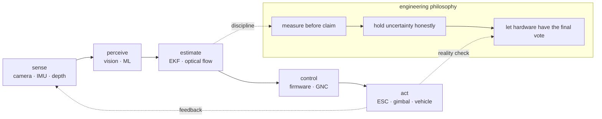
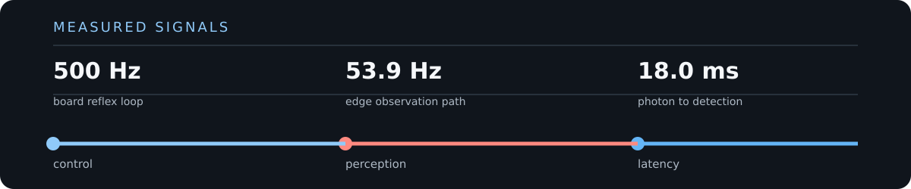

# fh1m

**Autonomy systems · robotics · embedded control**

Perception, estimation, and control for machines that operate outside the screen.

<table border="1" cellpadding="4" cellspacing="0">
<tr><td align="center">

</td></tr>
</table>

&nbsp;&nbsp;

&nbsp;&nbsp;

&nbsp;&nbsp;

## The loop

The recurring problem is not “which framework?” It is whether the measurement arrives in time, the estimate is honest, and the actuator does what the model asked.

## Engineering trajectory

From first-principles software to integrated vehicle autonomy.

| system surface | engineering signal | inspect |
| --- | --- | --- |
| **Foundations** | Python, C, first-principles ML, developer tooling | [Scripts](https://github.com/fh1m/Scripts) · [PDE](https://github.com/fh1m/PDE) · [ML](https://github.com/fh1m/Linear-Regression) |
| **Vehicle systems** | underwater robotics, simulation, embedded sensing, mission software | [Duburi](https://github.com/fh1m/Duburi) · [simulator](https://github.com/fh1m/duburi-sim_ws) · [vision](https://github.com/fh1m/Arduino-Vision) |
| **Edge perception** | on-device vision, prediction, image processing, compact protocols | [Dristy](https://github.com/fh1m/Dristy) · [tracking](https://github.com/fh1m/Track_and_Predict) · [P2P](https://github.com/fh1m/secure-terminal-p2p-chat) |
| **Integrated autonomy** | ROS 2, MAVLink 2, Hailo-8, EKF, optical flow, board control | [Mongla](https://github.com/fh1m/mongla_ws) · [now](https://fh1m.github.io/now) · [log](https://fh1m.github.io/log) |

The work index carries the full catalogue; each row here is a change in engineering scope.

## Measured work

Numbers are here to define interfaces and limits, not decorate the page.

| signal | what it says |
| --- | --- |
| **500 Hz** | the reflex loop belongs on the board |
| **53.9 Hz** | edge vision can produce a usable observation |
| **18.0 ms** | photon-to-detection was measured, not guessed |
| **44 bytes** | a movement request can cross the cable without smuggling in actuator logic |
| **4,208 tests** | the stack is larger than its demo |
| **320 × 240 / 25.4 FPS** | Dristy gives a small camera a bounded job |

> An ESC can report a perfectly respectable zero with nothing attached. A message count is not proof that a thruster is alive.

## Research, leadership, and field work

The surrounding work: research, competition systems, and engineering ownership.

Rockets and UAVs: TVC control, flight computers, trajectory prediction, VSLAM, and GPS-denied navigation. 
Rovers: inverse kinematics, edge alignment, OCR, and competition data pipelines. 
Research: underwater object detection and recommendation systems. 
Leadership: engineering ownership across vision, autonomy integration, reliability, and field execution.

## Technical surface

The tools are broad; the invariant is the full loop from sensor to actuator.

**Languages** · Python · C/C++ 
**Robotics** · ROS 2 · MAVLink 2 · Gazebo · ArduPilot 
**Perception** · OpenCV · Hailo-8 · optical flow · EKF 
**Embedded** · ESP32 · K210 · board-level control

[Full record](https://fh1m.github.io/) · [About](https://fh1m.github.io/about) · [Repositories](https://github.com/fh1m?tab=repositories)

Dhaka, Bangladesh
