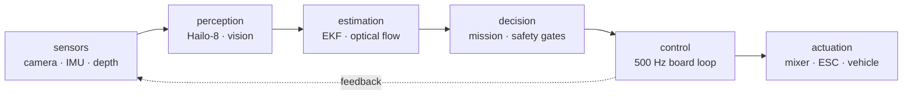

# Fahim Faisal

**Autonomy systems · robotics · embedded control**

Perception, estimation, and control for underwater, aerial, and ground robots.

## Technical record

| **CONTROL** | **VISION** | **LATENCY** | **PROTOCOL** | **VERIFICATION** |
|:---:|:---:|:---:|:---:|:---:|
|  |  |  |  |  |

## System focus

The engineering problem is the boundary between each block: timing, uncertainty, interfaces, and failure behavior.

## Selected systems

### [Mongla](https://github.com/fh1m/mongla_ws)

Underwater autonomy stack: board-level control, edge perception, optical flow, right-invariant EKF, and explicit `BENCH / BUILT / BLOCKED / WATER` capability states.

### [Dristy](https://github.com/fh1m/Dristy)

Vision co-processor for detection, colour, motion, QR, tags, and optical flow. The robot receives a compact result, not a video stream.

### [Flight and field robotics](https://fh1m.github.io/)

Flight computers, trajectory prediction, rover manipulation, OCR, and competition data pipelines.

## Engineering surface

`ROS 2` · `Python` · `C/C++` · `ESP32` · `K210` · `Hailo-8` · `MAVLink 2` · `OpenCV` · `EKF` · `Gazebo` · `ArduPilot`

Dhaka, Bangladesh

