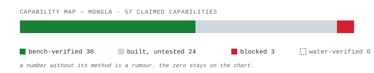

<table>
<tr>
<td width="380">

<br/>
<sub><em>Duburi workstation, RoboSub 2025 — one of the later nights.</em></sub>
</td>
<td valign="top">
<br/>

# Fahim Faisal

**Autonomy engineer.** I build machines that perceive, reason, and act — underwater, in the air, and on the ground — and that have to work correctly when nobody is watching.

Dhaka, Bangladesh · [fh1m.github.io](https://fh1m.github.io)

> *Proof of work, not adjectives.*

</td>
</tr>
</table>

<br/>

### what i build

[**Mongla**](https://github.com/fh1m/mongla_ws) is the autonomy stack for a 702 mm AUV: a 500 Hz control loop on an isolated ESP32 core, Hailo‑8 vision running at 53.9 Hz, and a right‑invariant EKF fusing IMU, depth, and vision into one state estimate. Reflexes stay on the board. Thinking stays on the Pi. Nothing crosses that cable except a command.

```
photon ──capture──undistort──detect (Hailo-8)──track──EKF fuse──decide──actuate
        |────────────────── 18.0 ms, photon to actuation ──────────────────|
        |──────────────────────── budget: 40 ms ────────────────────────────|

  control loop   500 Hz    ESP32, isolated core, 500 Hz regardless of what the Pi is doing
  vision          53.9 Hz   Hailo-8, measured, not spec-sheet
```

Vision verbs return discrete states — `ALIGNED`, `LOST`, `TIMEOUT`, `NO_CAMERA`, `ABORTED` — never a guess dressed up as a target. Missing data renders as `--`, never as zero.

<br/>

### proof, not adjectives

<picture>
  <source media="(prefers-color-scheme: dark)" srcset="assets/capability-dark.svg">
  <source media="(prefers-color-scheme: light)" srcset="assets/capability-light.svg">
  
</picture>

A capability map that hides the blocked rows is marketing. This one doesn't. The `0` above is a real, counted row — not an omission — because the first principle is that you must not fool yourself, and you are the easiest person to fool.

<br/>

### selected work

| | |
|---|---|
| [**mongla_ws**](https://github.com/fh1m/mongla_ws) | The autonomy stack above. 1,038 commits, sole author, 3,756 tests passing. Full writeup, retractions included, on the site. |
| [**Duburi**](https://github.com/fh1m/Duburi) | The vehicle itself — hull, thrusters, control board. RoboSub 2025 semifinals, Entrepreneurship award. |
| [**Dristy**](https://github.com/fh1m/Dristy) | K210 vision firmware and host API — the eyes, before they were Hailo's problem. |

**Also:** University Rover Challenge 2025 — global top 10, ground rover autonomy. Two peer-reviewed papers. Four competition placements across underwater, ground, and air.

<br/>

### stack

`Python` `C` `ROS 2` `MAVLink` `Hailo-8` `ESP32 / RISC-V` `EKF · VSLAM` `PyQt6`

<br/>

---

<sub>
Every number on this page has a method behind it, same as on <a href="https://fh1m.github.io">fh1m.github.io</a> — ask and I'll show the measurement, not just the claim. Reach me at <strong>fh1m.faisal.work@gmail.com</strong>.
</sub>
