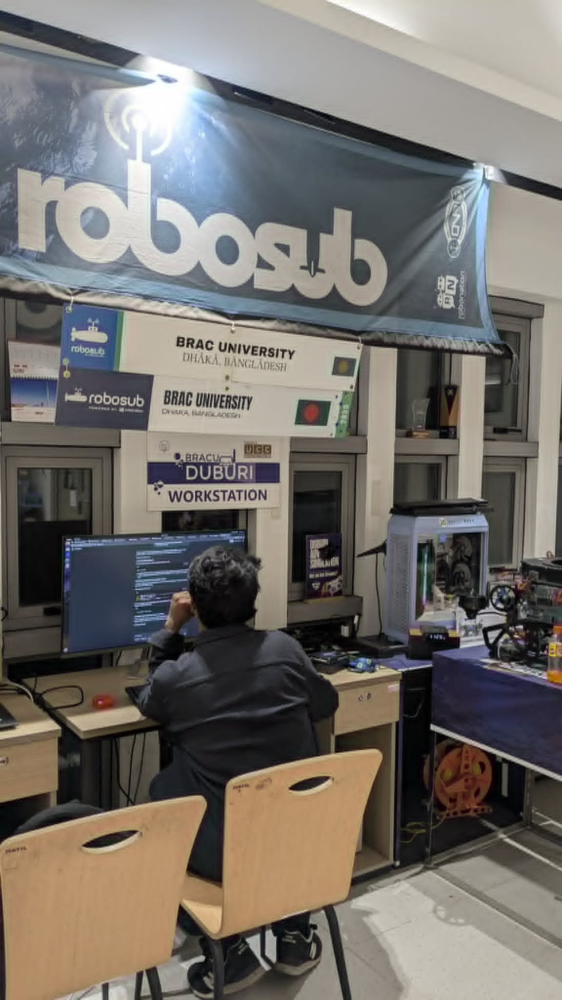

<em>the lab, one of the later nights.</em>

  

# Fahim Faisal

**Autonomy engineer.** Machines that perceive, reason, and act — and that have to work correctly when nobody is watching.

Dhaka, Bangladesh · [fh1m.github.io](https://fh1m.github.io) · *Proof of work, not adjectives.*

 

I started where machines are hardest to hide: something that has to leave the ground. Rockets taught me guidance and control; rovers taught me manipulation and vision; underwater vehicles taught me to trust nothing I hadn't measured. The thread through all of it is the same question — how does a machine understand the world well enough to act in it?

 

<picture>
  <source media="(prefers-color-scheme: dark)" srcset="assets/rule-dark.svg">
  <source media="(prefers-color-scheme: light)" srcset="assets/rule-light.svg">
  
</picture>

<picture>
  <source media="(prefers-color-scheme: dark)" srcset="assets/rail-dark.svg">
  <source media="(prefers-color-scheme: light)" srcset="assets/rail-light.svg">
  
</picture>

counted, not estimated — <a href="https://fh1m.github.io">method on the site</a>

<picture>
  <source media="(prefers-color-scheme: dark)" srcset="assets/rule-dark.svg">
  <source media="(prefers-color-scheme: light)" srcset="assets/rule-light.svg">
  
</picture>

### what i believe

I like machines that have to deal with reality. 
I like taking expensive or opaque systems apart and rebuilding them from first principles. 
I like hardware, because physics gets the final vote. 
I like open source, because knowledge should compound.

*And I am still building.*

> 958 / 958 — ESC frames read exactly 0 with nothing attached. A message count can never prove a thruster is alive.

<picture>
  <source media="(prefers-color-scheme: dark)" srcset="assets/rule-dark.svg">
  <source media="(prefers-color-scheme: light)" srcset="assets/rule-light.svg">
  
</picture>

**Latest from the notebook:** *[The 71 transposes that were one operation](https://fh1m.github.io/writing)* — how a feature matcher that refused to compile for a neural accelerator turned out to be one idea wearing 71 masks.

**On the desk:** *The Creative Act* (Rick Rubin) · tinygrad internals (geohot) · papers on right-invariant EKFs

<picture>
  <source media="(prefers-color-scheme: dark)" srcset="assets/rule-dark.svg">
  <source media="(prefers-color-scheme: light)" srcset="assets/rule-light.svg">
  
</picture>

Python · C · ROS 2 · MAVLink · Hailo-8 · ESP32 / RISC-V · EKF · VSLAM · PyQt6

 

*let's build something that has to work.*

 

Every number on this page has a method behind it, same as on <a href="https://fh1m.github.io">fh1m.github.io</a> — ask and I'll show the measurement, not just the claim. Reach me at <strong>fh1m.faisal.work@gmail.com</strong>.

